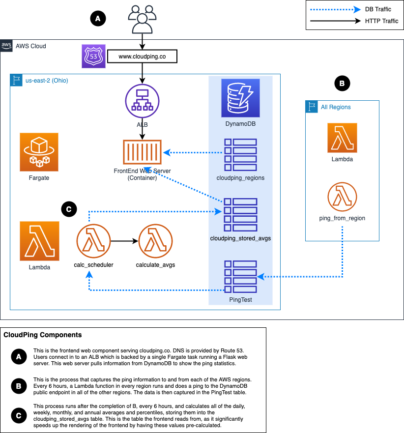

# CloudPing

Records inter-region latency over a TCP connection between all AWS regions.

## About this Project

Over time, as I've worked on global AWS deployments, I have often been faced with the question of which inter-region transactions will be faced with the most latency. I have been able to find a lot of static examples of previous testing completed, or anecdotal thoughts based on a region's location. I haven't been able to find any kind of dynamic, consistently updated, latency monitoring. The goal here is to provide a single source of truth for inter-region AWS region latency.

## Architecture

## Parts of Application

### Front End

The front end of CloudPing is running in a Fargate container as a Python Flask web server. The web server pulls its data from DynamoDB and uses that data to populate the data in the table.

### Region-to-Region Pings

Each active AWS region has a Lambda function that runs every 6 hours. This function does a ping of the public DynamoDB endpoint (`dynamodb.<region>.amazonaws.com`) and stores the RTT for the ping in to a DynamoDB table.

### Averages and Percentile Calculations

Every 6 hours, after the completion of the region-to-region pings, the data is taken from the raw results DynamoDB table. The data is then used to calculate daily, weekly, monthly, and annual averages and percentiles between all of the active regions. This data is then stored in a summary DynamoDB table which is used to provide data to the front-end.

### DynamoDB Tables

* `PingTest` - this table stores the raw data for round trip ping times to and from each region. The data in this table goes back to CloudPing's launch in 2017.
* `cloudping_regions` - this table lists the AWS regions which are enabled in CloudPing and drives the regions that are shown on the front end.
* `cloudping_stored_avgs` - this table contains the summarized averages and percentiles and is the table used to populate the front-end data.

## Deployment Instructions

The Lambda functions are deployed with AWS Chalice.
The front-end web site is deployed as a Docker image, stored in ECR, and served by a Fargate service which exists behind an ALB.

## TODO

* API access - both to raw data stored in DyanmoDB, as well as to specific queries used primarily by the web front-end.
* Graph showing latency over time for user selected parameters (between regions, specific timeframes, etc.)
* GovCloud and China regions (if anyone is able to help make this happen, please reach out!)

## Additional Notes

This project is in no way associated with Amazon or AWS. If you wish to report any issues with the project, please use the "Issues" feature within GitHub.
